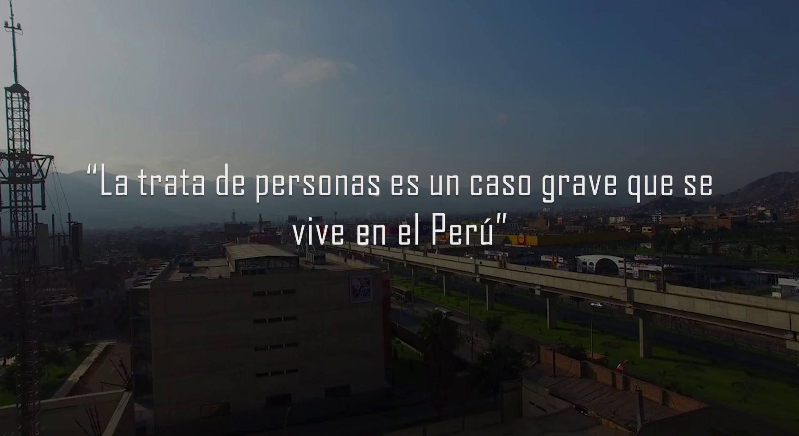
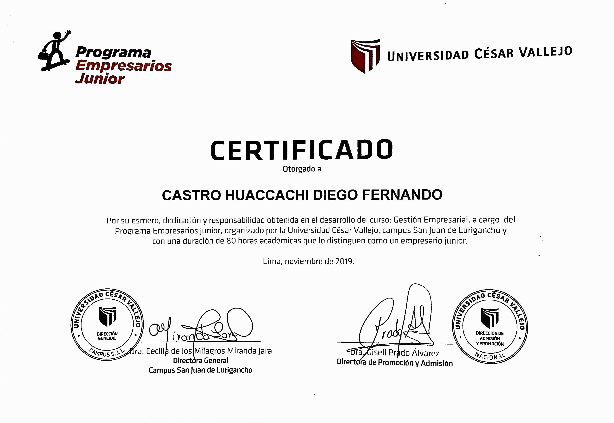

<!doctype html>
<html>
<head>
<meta charset="utf-8">
<meta name="viewport" content="width=device-width, initial-scale=1">
<title>Diego F. Castro</title>
	<link href="Css/style.css" rel="stylesheet">
	<link rel="stylesheet" href="https://stackpath.bootstrapcdn.com/bootstrap/4.4.1/css/bootstrap.min.css" integrity="sha384-Vkoo8x4CGsO3+Hhxv8T/Q5PaXtkKtu6ug5TOeNV6gBiFeWPGFN9MuhOf23Q9Ifjh" crossorigin="anonymous">
	
	<link href="https://fonts.googleapis.com/css?family=Lobster&display=swap" rel="stylesheet">
	<link href="Css/animate.css" rel="stylesheet">
	<link href="https://fonts.googleapis.com/css?family=Dancing+Script&display=swap" rel="stylesheet">
	
</head>

<body>
	
	<header class="header">
		

			
			
			<nav class="navigation">
				<ul>
					<li><a href="">Inicio</a></li>
					<li><a href="Acerca.html">Acerca</a></li>
					<li><a href="Contactame.html">Contactame</a></li>
					<li></li>
					<li></li>
				</ul>
			</nav>
		

	</header>
	
	<!--carusel-->
	

  <ol class="carousel-indicators">
    <li data-target="#carouselExampleCaptions" data-slide-to="0" class="active"></li>
    <li data-target="#carouselExampleCaptions" data-slide-to="1"></li>
    <li data-target="#carouselExampleCaptions" data-slide-to="2"></li>
  </ol>
  

    

      
      

        <h5>Fotógrafo</h5>
        
Ganador del Segundo puesto de fotografía digital al nivel de la UGEL 05

      

    

    

      
      

        <h5>Productor de Video</h5>
        
Reconocido como el mejor productor de video de la I.E R.P.P

      

    

    

      
      

        <h5>Diseñador gráfico</h5>
        
Con conocimientos en diseño web y marketing digital.

      

    

  

  <a class="carousel-control-prev" href="#carouselExampleCaptions" role="button" data-slide="prev">
    
    Previous
  </a>
  <a class="carousel-control-next" href="#carouselExampleCaptions" role="button" data-slide="next">
    
    Next
  </a>

	
	<main class="main fondo img-fluid">
		

			

				

			

			 
			

				<h1 class="titulo" style="font-size: 40px;">Logros</h1>
			

				  
				
				
				
			

  

    <iframe class="card-img-top" src="https://www.youtube.com/embed/Jb5RdlG9mEM" frameborder="0" allow="accelerometer; autoplay; encrypted-media; gyroscope; picture-in-picture" allowfullscreen></iframe>
    

      <h5 class="card-title">Producción de Video</h5>
      
Ganador del concurso de video de asuntos públicos realizado por la I.E.E Ramiro Prialé Prialé, con un video sobre la trata de personas realizada en conjunto con el salón "5 E".

    

    

      <small class="text-muted">Last updated 3 mins ago</small>
    

  

  

    
    

      <h5 class="card-title">Fotografía</h5>
      
Ganando el 2do puesto en fotografía digital, he sido considerado uno de los mejores fotógrafos zonales en nivel Secundaria.

    

    

      <small class="text-muted">Last updated 3 mins ago</small>
    

  

  

    
    

      <h5 class="card-title">Academico</h5>
      
Concluí de forma exitosa el curso de Gestión Empresarial dada por el programa Empresarios Junior de la Universidad César Vallejo. Por lo cual se me entregó aquel título en nombre de la nación.

    

    

      <small class="text-muted">Last updated 3 mins ago</small>
    

  

	

    
    

      <h5 class="card-title">Profesional</h5>
      
Ingreso exitoso a la Universidad Tecnológica del Perú (UTP) a la carrera de Ingeniería de Sistemas e Informática.

    

    

      <small class="text-muted">Last updated 3 mins ago</small>
    

  

				
					
			
			

		

		 
		 
		 
		 
	</main>
	<footer class="footer">
		

			
Página diseñada por @Diego Castro

		

	</footer>
	
	
	
	
	
	
	
</body>
</html>
